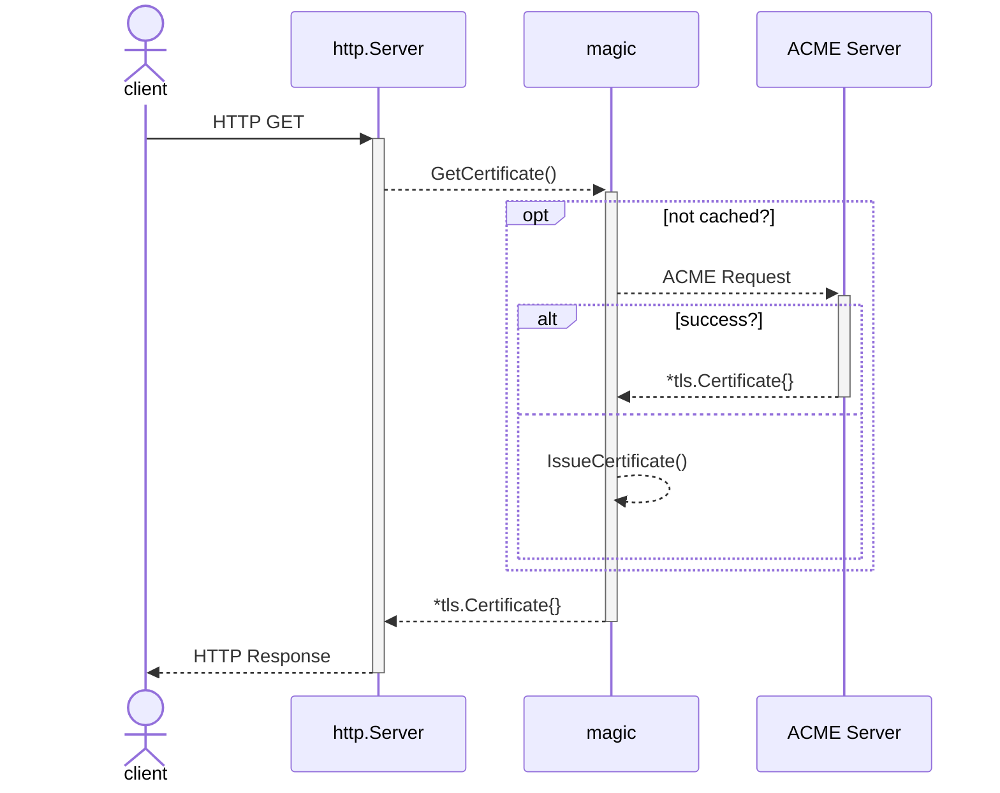

# magic

`magic` is a TLS store that falls back to self-signed if needed,
uses ACME to acquire new certs, and renews those about to expire.

## Sequence

## Related Projects

* [Darvaza Autocert](https://darvaza.org/darvaza/shared/storage/autocert)
